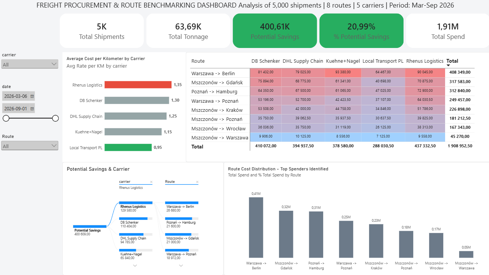

# Freight Procurement & Carrier Benchmarking Dashboard




> **Core Business Question:** *How much could annual transport spend be reduced by benchmarking contractor freight rates and systematically reallocating volumes toward cost-efficient carriers?*

---

# Project Overview

An end-to-end logistics analytics project focused on freight procurement, contractor rate benchmarking, and cost optimization. 

The analysis is based on 5,000 transport shipments originating from a central distribution hub in **Mszczonów**, covering 8 strategic domestic and international lanes operated by 5 contract carriers[cite: 2]. 

The primary objective was to uncover rate leakage, evaluate carrier price variance against an operational benchmark, and quantify the theoretical financial upside of volume reallocation and contract renegotiation[cite: 2].

---

# Key Findings & Metrics

| KPI | Value | Business Context |
| :--- | :--- | :--- |
| **Total Shipments** | **5,000** | Executed road transport orders (FTL/LTL)[cite: 2] |
| **Total Tonnage** | **63.7K t** | Total freight weight handled across all corridors |
| **Total Spend** | **1.91M PLN** | Baseline logistics expenditure |
| **Weighted Avg. Rate** | **1.20 PLN/km** | Portfolio-wide weighted average cost per km |
| **Benchmark Rate** | **0.95 PLN/km** | Established by *Local Transport PL* (lowest contractor rate)[cite: 2] |
| **Max Carrier Rate** | **1.35 PLN/km** | Billed by *Rhenus Logistics* (+42% variance vs benchmark)[cite: 2] |
| **Estimated Savings Opportunity** | **400.61K PLN** | Theoretical budget reduction (~21% of total spend) |

### Key Operational Insights
* **Primary Rate Offender:** *Rhenus Logistics* averages 1.35 PLN/km, generating the largest individual rate variance across high-volume corridors[cite: 2].
* **Core Leakage Corridor:** The `Warszawa -> Berlin` lane represents the largest single cost pool, with an estimated **83.8K PLN** in potential savings due to heavy reliance on premium carriers (*Rhenus* and *DB Schenker*)[cite: 2].
* **Carrier Rate Disparity:** Stave rates show wide spreads across identical lanes (e.g., 0.95 vs 1.35 PLN/km), indicating that volume was assigned based on operational habit rather than strict procurement rate tiers[cite: 2].

---

# Architecture & Pipeline

```text
                 ┌─────────────────────────┐
                 │       MySQL DB          │
                 │ 5,000 shipments records │
                 │    + carrier tariffs    │
                 └────────────┬────────────┘
                              │
                              ▼
                 ┌─────────────────────────┐
                 │     Python Pipeline     │
                 │   Pandas ETL / Audit    │
                 │ Cost-per-kg derivations │
                 └────────────┬────────────┘
                              │
                              ▼
                 ┌─────────────────────────┐
                 │    Power BI Desktop     │
                 │  Star Schema Data Model │
                 │      DAX Analytics      │
                 │  Executive Visual UI    │
                 └────────────┬────────────┘
                              │
                              ▼
                 ┌─────────────────────────┐
                 │  Procurement Strategy   │
                 │ Volume reallocation &   │
                 │  Lane contract targets  │
                 └─────────────────────────┘

```

# Relational Schema & Modeling

The project employs a normalized Star Schema designed for reporting efficiency:

* **Fact Table (`shipments`):** Individual transport orders including `shipment_id`, `date`, `origin`, `destination`, `distance_km`, `weight_kg`, `carrier_id`, and `total_cost`.


* **Dimension Table (`carriers`):** Vendor master data including `carrier_id`, `name`, and base contracted `cost_per_km`.

---

# Key DAX Measures

# 1. Optimal Benchmark Rate

Determines the baseline rate dynamically based on the lowest observed contractor tariff:

```dax
Optimal Benchmark Rate = 
MINX(
    ALL('freight_db carriers'[name]),
    [Average Rate per KM]
)

```

# 2. Estimated Savings Opportunity

Calculates the aggregate financial leakage against the 0.95 PLN/km benchmark target:

```dax
Potential Savings = 
SUMX(
    'freight_db shipments',
    'freight_db shipments'[total_cost] 
        - ('freight_db shipments'[distance_km] * [Optimal Benchmark Rate])
)

```

# 3. Savings Share (%)

```dax
% Potential Savings = 
DIVIDE([Potential Savings], [Total Spend], 0)

```

# 4. Dynamic Executive Alert Color

```dax
Kolor Słupka = 
SWITCH(
    SELECTEDVALUE('freight_db carriers'[name]),
    "Rhenus Logistics", "#E74C3C",    -- Critical Cost Driver (Alert Red)
    "Local Transport PL", "#27AE60",  -- Contract Benchmark (Target Green)
    "#95A5A6"                         -- Standard Market Spread (Neutral Gray)
)

```

# Practical Procurement Takeaways

The dashboard supports tangible logistics decisions:

1. **Targeted Renegotiation:** Prioritizes lanes with the highest absolute spend (`Warszawa -> Berlin`, `Mszczonów -> Gdańsk`) rather than attempting blanket renegotiations across all 8 routes.


2. **Dual-Sourcing Strategy:** Highlights corridors where *Local Transport PL* or *Kuehne+Nagel* can absorb additional volume up to capacity limits.


3. **Contract Rate Ceilings:** Establishes data-backed target ceilings (e.g., max 1.10 PLN/km) for secondary carriers during annual tender cycles.

---

# Domain Context & Disclaimer

* **Model Assumptions:** The savings figure represents a theoretical upper-bound scenario assuming 100% volume reallocation at the benchmark rate without capacity bottlenecks, spot market surcharges, or service degradation. In operational practice, savings would be phased in via volume caps and SLA considerations.
* **Data Origin:** The dataset consists of 5,000 synthetically generated shipment logs modeled to reflect real-world Polish road transport distributions, vehicle capacities (FTL up to 24t), and typical European carrier rate spreads.

---

# How to Run Locally

1. **Seed Relational Database:**
```bash
python setup_db.py

```

2. **Run Python Data Processing & Export:**
```bash
python analysis.py

```

3. **Open BI Report:**
Launch `freight_procurement_dashboard.pbix` in Power BI Desktop and hit **Refresh**.
